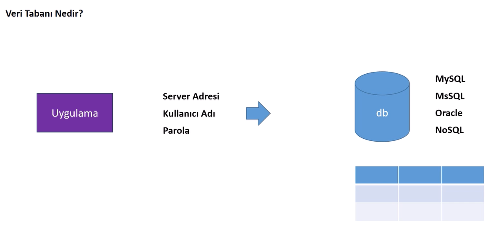

## **Veri Tabanı**

CSV üzerinden veri çekilmesi gerektiğinde, csv dosyası direkt belleğe alınıp bellek üzerinden dosya içeriği filtrelenmeli. 50 100 kayıt için bu sorun değil fakat daha fazla kayıt olması bellek üzerinde gereksiz yer kaplanmasına neden olur. Bundan dolayı veri tabanı kullanılır. 



### MySQL Kurulumu 
https://dev.mysql.com/downloads/


- MySQL Community Server  : server kurulacak 
- MySQL Workbench : arayüz kurulacak
- MySQL Installer for Windows : Windows için ikisini aynı anda kurmaya yarar


- Custom ile hem server hem de arayüz(Workbench) bilgisayara kurulur.


- Server ve Workbench için aynı sürümler seçildi.


- Execute ile kurulum tamamlanır.


- herhangi bir değişiklik yapılmıyor. port = 3306


- Root parolası girilmeli ve unutulamalı. Arayüze bu şifre ile giriş yapılır.


- İlk açılna arayüz.


### Veri Tabanı Oluşturma


- Şema(veri tabanına karşılık gelir) oluşturulur.


- **pruducts** adlı bir tablo oluşturulur.
- Tabloya sütunlar eklenir.
- **Id** sütunu için:
    - **PK:** primary key (birincil anahtar)
    - **NN:** not null, boş kayıt olmayacak
    - **UQ:** unique, her değer birbirinden farklı olacak
    - **AI:** auto increment, her eklenen kayıt değeri birer birer artacak
    - Veri tipi **INT** olacak
- **name** sütunu için:
    - Maksimum 255 karaktere sahip olacak, veri tipi **VHARCHAR** text sütunları için
    - **NN:** not null
- **price** sütunu için:
    - Veri tipi **DECIMAL** olarak sayısal bir değere karşılık gelecek
    - **NN:** not null
- **imageUrl** sütunu için:
    - Maksimum 45 karaktere sahip olacak, veri tipi **VHARCHAR** text sütunları için
    - Boş değer alabilir
- **description** sütunu için:
    - Veri tipi **TEXT** olarak uzun yazılara karşılık gelebilir

- **DROP TABLE shopdb.categories2;** -> Tablo silme scripti


- Yukarıdaki işlemler (veri tabanını, tabloyu, sütunları oluşturmak) için server a uygulanacak olan script


- SELECT * FROM shopdb.products;  ->  tablonun tamamını getirir
- INSERT INTO `shopdb`.`products` (`name`, `price`, `imgUrl`, `description`) VALUES ('Samsung S25 ', '50000', '1.jpg', 'güzel bir telefon');   -> tabloya yeni bir ürün eklenir

### Veri Tabanı Bağlantısı / MySQL ile Python Kullanımı 

Python ile mysql serverın bağlantısı yapılmalıdır. Hangi programlama dili kullanılıyor olursa olsun mysql, oracle gibi serverlara bağlanmak için o programlama dilinde geliştirilmiş olan bir arayazılıma ihtiyaç vardır.

- **mysql-connector-python** arayazılımı bilgisayara kurulmalıdır.
    - pip install mysql-connector-python

##### mysql_connection.py 

Bu python dosyası, **MySQL** veritabanına Python aracılığıyla bağlanmayı ve temel SQL komutlarının nasıl kullanılacağını göstermektedir. Projede `mysql.connector` kütüphanesi kullanılmıştır.  

- MySQL veritabanına bağlantı yapılır.  
- Bir cursor oluşturularak SQL sorguları çalıştırılır.  
- Yeni bir tablo oluşturulur ve mevcut tablolar listelenir.  

**1. MySQL Bağlantısı Kodu**
```python
import mysql.connector

db = mysql.connector.connect(
    host="localhost",      # Localhost veya uzak sunucu adresi
    user="root",           # Kullanıcı adı
    password="....",  # Kullanıcı şifresi
    database="shopdb"      # Bağlanmak istenen veritabanı
)

print(db)  # Bağlantının başarılı olup olmadığını kontrol etmek için
```

**2. Cursor Oluşturma**
SQL sorgularını çalıştırmak için bir **cursor** nesnesi oluşturulur.  

```python
cursor = db.cursor()
```

**3. Veritabanı ve Tablo İşlemleri**
- Yeni bir tablo oluşturma:  
```python
cursor.execute("CREATE TABLE categories2 (id INT AUTO_INCREMENT PRIMARY KEY, name VARCHAR(255))")
```

- Mevcut tabloları listeleme:  
```python
cursor.execute("SHOW TABLES")

for i in cursor:
    print(i)  # Tabloların listesini döndürür
```

#### Notlar  
- Bağlantı bilgileriniz (örneğin, `password`) gizli kalmalıdır. Kodunuzu paylaşmadan önce şifrenizi değiştirin veya gizli bir yöntemle yönetin.  
- Kodda yer alan tüm sorgular, bir MySQL veritabanı üzerinde çalıştırılacak şekilde tasarlanmıştır.  

#### Geliştirme İpuçları  
- Veritabanı işlemlerini daha verimli hale getirmek için **try-except-finally** yapısı kullanabilirsiniz.  
- Tabloya veri eklemek, güncellemek ve silmek için ek SQL sorguları ekleyerek bu projeyi geliştirebilirsiniz.


### Python ile MySQL Sorguları

Bu proje, Python kullanarak MySQL veritabanı üzerinde temel veri işlemlerini gerçekleştirmek için hazırlanmıştır. Kodlar, `mysql.connector` modülü ile veritabanı bağlantısı kurularak veri ekleme, silme, güncelleme ve sorgulama işlemleri yapılmasına olanak sağlar. Her bir dosya, ilgili işlem için örnekler ve dinamik yöntemler içermektedir.

---

**Veri Ekleme:**  
`insert_data.py` dosyasında veritabanına yeni kayıt eklemek için örnekler sunulmuştur. Tek bir kayıt eklemek için `execute`, birden fazla kayıt eklemek için `executemany` metodu kullanılmıştır. Verilerin veritabanına işlenmesi için `db.commit()` komutu gereklidir. Örnek:

```python
sql = "INSERT INTO products (name,price,imgUrl,description) VALUES (%s,%s,%s,%s)"
values = [
    ("Samsung S23", 80000, "7.jpg", "iyi bir telefon"),
    ("Samsung S24", 90000, "8.jpg", "iyi bir telefon"),
]
cursor.executemany(sql, values)
db.commit()
```

Hatalar için `try-except` yapısı kullanılmıştır. Örneğin, bir hata oluştuğunda detaylı bilgi sağlanır ve bağlantı düzgün bir şekilde kapatılır.

---

**Veri Sorgulama:**  
`select_data.py` dosyasında, veritabanından belirli ya da tüm kayıtları getirme işlemleri bulunmaktadır. Örneğin, bir tabloyu tamamen çekmek için:

```python
sql = "SELECT * FROM products"
cursor.execute(sql)
products = cursor.fetchall()
for product in products:
    print(product)
```

Sorguları dinamikleştirmek için parametreler kullanılabilir. Örneğin, bir ürünün adını ve fiyatını ID ile almak için:

```python
def getPriceNameById(id):
    sql = "SELECT name, price FROM products WHERE id=%s"
    cursor.execute(sql, (id,))
    result = cursor.fetchone()
    print(f"Ürün adı: {result[0]}, Fiyat: {result[1]}")
```

---

**Veri Güncelleme:**  
`update_data.py` dosyasında, kayıtların güncellenmesi için örnekler yer alır. Güncellemeler, dinamik parametreler kullanılarak yapılabilir. Örnek bir fonksiyon:

```python
def updateProduct(id, name, price):
    sql = "UPDATE products SET name=%s, price=%s WHERE id=%s"
    cursor.execute(sql, (name, price, id))
    db.commit()
    print(f"{cursor.rowcount} kayıt güncellendi.")
```

---

**Veri Silme:**  
`delete_data.py` dosyasında, kayıtların silinmesi için örnekler bulunur. Belirli bir ID'ye göre silme işlemi şu şekilde yapılır:

```python
def deleteProductById(id):
    sql = "DELETE FROM products WHERE id=%s"
    cursor.execute(sql, (id,))
    db.commit()
    print(f"{cursor.rowcount} kayıt silindi.")
```

Dinamik sorgularla daha esnek işlemler yapılabilir.

---

Tüm dosyalar, veritabanı bağlantısını doğru bir şekilde kapatmayı garanti eden `finally` bloğu ile çalışır. Projede, MySQL ile etkileşim sırasında oluşabilecek hataları yönetmek için `mysql.connector.Error` sınıfı kullanılmıştır. Bu yapı, güvenilir ve esnek bir kodlama sağlar.


### **Birden Fazla Tablo İle Çalışma**

İki tabloyu ilgilendiren join işlemleri gerekebilir.


- **products** adlı tabloya **categoryId** adlı sütun olan **yabancı anahtar** eklenir. Bu yabancı anahtar **categories** adlı tablonun **birincil anhatarına (primary key)** karşılık gelir.
- Ayrıca bu categoryId sütunu fiziksel olarak bağlanmalıdır. Bu iki tablo arasında kıstılama eklemeye yarar.


```python
USE shopdb; 
ALTER TABLE products
ADD CONSTRAINT fk_categories_products     
FOREIGN KEY (categoryId) REFERENCES categories(id);
```

- ALTER TABLE sorgusu, bir tabloya foreign key (yabancı anahtar) eklemek için kullanılır.
- Veri tabanı seçilir.
- Yabancı anahtar eklenecek olan tablo (products) seçilir.
- "fk_categories_productsbir" adında bir constraint(kısıtlama) eklenir. 
- Yabancı anahtar ve referans(categories tablosundaki birincil anahtar) verilir.


- **products** tablosunda **fk_categories_products** adlı yabancı anahtar görülür.


- Eğer **products** tablosunda **categoryId** sütununa "0" değeri girilirse hata alınır çünkü **categories** tablosunda "0" değeri yok.

```python
"SELECT products.name,categories.name from products inner join categories on products.categoryid=categories.id"
```
```python
"SELECT p.name,c.name from products p inner join categories c on p.categoryid=c.id"
```
- **INNER JOIN** ifadesi kullanarak iki tablo arasında bir ilişki kurar ve her iki tablodan seçilen sütunları birleştirerek sonuç döndürür. 


- **LEFT JOIN** ve **RIGHT JOIN**, birleştirme işlemlerinde eksik eşleşmelerin nasıl ele alındığını belirler.

```python
"SELECT products.name AS product_name, categories.name AS category_name FROM products LEFT JOIN categories ON products.categoryid = categories.id"
```

- **LEFT JOIN**, sol (ilk belirtilen) (products) tablodaki tüm satırları döndürür ve sağ tablodaki eşleşmeyenler için NULL döndürür.


```python
"SELECT products.name AS product_name, categories.name AS category_name FROM products RIGHT JOIN categories ON products.categoryid = categories.id"
```

- **RIGHT JOIN**, sağ (ikinci belirtilen) (categories) tablodaki tüm satırları döndürür ve sol tablodaki eşleşmeyenler için NULL döndürür.


- **LEFT JOIN:** Sol tablodaki (products) tüm veriler (eşleşme olsa da olmasa da) sonuçta yer alır. Sağ tabloda eşleşme yoksa NULL döner.
- **RIGHT JOIN**: Sağ tablodaki (categories) tüm veriler (eşleşme olsa da olmasa da) sonuçta yer alır. Sol tabloda eşleşme yoksa NULL döner.


### Memory Caching (memory_caching.py)

- Veri tabanı performansını arttırmak için memory caching (önbellekleme) kullanılır.
- Uygulama yoğun kullanıldığı zaman database ile uygulama arasındaki iletişimin performanslı bir hale getirilmesi gerekir. Çünkü uygulama belirli bir yoğunluk altında çalışmaz duruma gelebilir. Bundan dolayı caching işlemi önemlidir.
- Çok trafik almayan uygulamalarda cachlemeye gerek yok.s


- Uygulamadan gelen veri **memory(ram)'de** saklanabilir, bir **diskte** saklanabilir veya bir **harici hizmetle(external)** saklanabilir. Biz basit olarak memory üzerinde saklayacağız.

```python
@cached(cache=TTLCache(maxsize=32, ttl=60))
```
- **cachetools** kütüphanesi indirilri (pip install cachetools)
- **cached** decoratörü yardımıyla cahcleme işlemi yapılır.
- cache in süresini belirlemek için **TTLCache** modülü kullanılır.
- **maxsize:** cache üzerinde tutulacak max kapasiteye belirtir
- **ttl:** cache bellek üzerinde ne kadar süre tutulacağını belirtir,dakika cinsinden değer verilir (60: 60 dk) 
