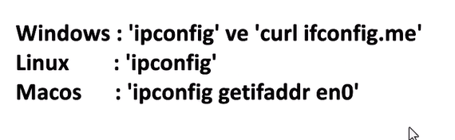
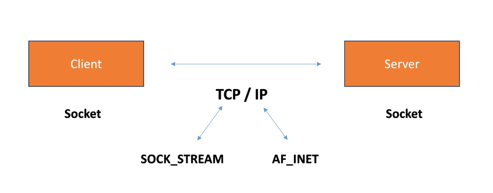
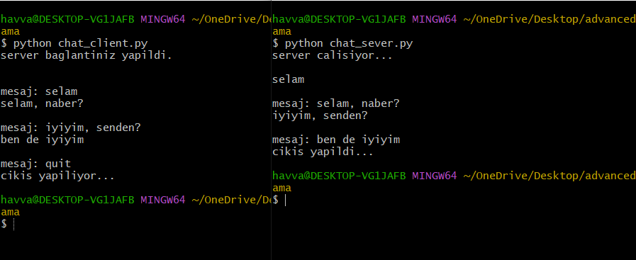

# Socket Programlama

### İnternet

- Milyarlarca elektronik cihazın haberleşme amacıyla bağlandığı global ağ sistemidir. 

- Global ağ sistemine dahil olan cihazları server ve client olarak gruplayabiliriz. 

1) Peki bu ağdaki cihazlar birbirlerine nasıl bağlanıyorlar?
2) Bir cihazdan diğerine bilgiler nasıl iletiliyor?

### WAN VE LAN

**WAN (Wide Area Network):** Geniş çaplı ağlar olarak adlandırılır. Örneğin; internet. 

**LAN (Local Area Network):** Az sayıda cihazın bağlı olduğu ağlara denir. Örneğin; ev ağı.

### IP Adresi

İnternet ağına bağlı olan cihaza verilen benzersiz bir kimliktir. 

- Modemin aldığı tek bir IP adresi vardır. Bu IP adresine **public IP adresi** denir. (internet ortamında)

- Ev ağınıza bağlı olan her cihazın aldığı IP adresidir. Bu IP adresine **local IP adresi** denir. (local ortamda) 

- Örneğin; bir evde 5 bilgisayar olabilir. Bu 5 bilgisayarın ev ortamında farklı IP adresileri olmalıdır (local IP adresi). Bu IP'ler dış dünyaya açıldığında tek bir IP ile gider (public IP adresi). 

Bu komutları cmd ortamında çalıştırdığımızda bigisayarın IP bilgisine ulaşılır.

- 
### Port Adresi

- Bir IP adresine sahip bir bilgisayardaki servis ya da uygulamalar iletişim için farklı port numaraları kullanılırlar. 

- Port numaraları 0'dan 65535'e kadar verilir. 

- Bazı bilindik servisler bilindik port numaraları kullanırlar. 

- **netstat** komutu ile bilgisayarda uygulamaların çalıştığı port numarlarını öğrenebilirsiniz. 

## Socket Nedir?

- **Server:** Bilgi servisi sunar.
- **Client:** Bu hizmete bağlanıp bu hizmeti tüketir. 

- Haberleşmenin yapıldığı iki tarafa da **socket** denir.

- TCP protokolü üzerinden bir veri iletimi yapacağımızı belirtmek için **SOCK_STREAM** ismindeki sabit kullanılır. 

- IPv4 formatını kullanılacağını da **AF_INET** sabit ile tanımlanır.

- **TCP/IP:** Client ve serverın birbirlerine bağlanma protokolüdür. 

- **TCP (Transmission Control Protocol):** Bilgisayarlar arasında veri iletişiminin kurallarını koyan bir iletişim protokol bütünüdür. Paketleri internet üzerinden göndermek ve ağlar üzerinden veri ve mesajların başarılı bir şekilde teslim edilmesini sağlamak için tasarlanmıştır.

### client.py server.py 

Python'da soket programlama kullanarak bir server (sunucu) ve bir client (istemci) arasındaki iletişimi gerçekleştirilir. 

- İkisi arasında bağlantı kurmak için dosyaların konumlarında iki terminal açılır. 
- Birinde "python client.py", diğerinde "python server.py" komutu çalıştırılır. 
- Server tarafı hattı dinler. Client tarafından bir bağlantı yapıldığı anda da server tarafındaki kod (while true içeriği) çalışır.  

#### server.py (Sunucu):
1) Socket Oluşturma:
    - socket.socket(socket.AF_INET, socket.SOCK_STREAM) ile bir TCP/IP soketi oluşturulur.
    - AF_INET: IPv4 protokolünü kullanır.
    - SOCK_STREAM: TCP bağlantısı için kullanılır.

2) IP ve Port Ayarlama:
    - socket.gethostbyname(socket.gethostname()) ile sunucunun dinleyeceği dinamik bir yerel IP adresi alınır.
    - Port olarak 12345 belirlenmiştir.

3) Bind ve Listen:
    - bind((HOST, PORT)) ile soket, belirtilen IP adresi ve porta bağlanır.- listen() ile sunucu gelen bağlantıları dinlemeye başlar.

4) Bağlantı Kabul Etme:
    - accept() ile bir istemciden bağlantı isteği geldiğinde bu istek kabul edilir.
    - İstemcinin IP adresi ve port numarası client_address değişkeninde tutulur.

5) Mesaj Gönderme:
    - Bağlanan istemciye "merhaba" mesajı gönderilir (client_socket.send()).

6) Bağlantıyı Sonlandırma:
    - Sunucu bağlantıyı kabul ettikten sonra server_socket.close() ile soketi kapatır.

#### client.py (İstemci):

1) Socket Oluşturma:
    - socket.socket(socket.AF_INET, socket.SOCK_STREAM) ile sunucuya bağlanmak için bir TCP/IP soketi oluşturulur.

2) Bağlantı Kurma:
    - connect((HOST, PORT)) ile istemci belirtilen IP adresi ve porta bağlanır.

4) Mesaj Alma:
    - recv(1024) ile sunucudan gelen maksimum 1024 byte uzunluğundaki mesaj alınır.

5) Mesajı Ekrana Yazdırma:
    - Alınan mesaj decode("utf-8") ile çözülerek ekrana yazdırılır.

6) Bağlantıyı Sonlandırma:
    - client_socket.close() ile istemci bağlantıyı kapatır.

#### Bağlantının İşleyişi:
- Sunucu Tarafı:
    - server.py çalıştırıldığında sunucu, belirtilen IP adresi ve port üzerinden gelen bağlantıları dinler.

- İstemci Tarafı:
    - client.py çalıştırıldığında istemci, sunucunun IP adresi ve portuna bağlanır.

- Bağlantı ve Mesajlaşma:
    - Sunucu istemcinin bağlantısını kabul eder ve istemciye "merhaba" mesajını gönderir.
    - İstemci bu mesajı alır ve ekrana yazdırır.

- Bağlantı Kapanışı:
    - Sunucu ve istemci işlemleri tamamlandıktan sonra soketler kapatılır.

#### Önemli Notlar:

- **Tek Seferlik Bağlantı:** Sunucu, ilk bağlantıyı kabul ettikten sonra kapanır (break kullanılmış). Birden fazla bağlantı için while döngüsü değiştirilmelidir.

- **Dinamik IP Kullanımı:** socket.gethostbyname(socket.gethostname()) kullanılarak sunucunun yerel IP'si otomatik alınmıştır.

- **Bağlantı Testi:** Bu kodlar aynı yerel ağ üzerindeki cihazlar arasında çalışır. Eğer farklı ağlardaki cihazlar arasında bağlantı kurulacaksa, port yönlendirme yapılmalı veya genel bir IP adresi kullanılmalıdır.

### Chat Uygulaması

- Bu uygulama, bir istemci (client) ve bir sunucu (server) arasında metin tabanlı iletişim sağlamak için basit bir soket programlama uygulamasıdır.

- Server ve client arasında çift yönlü mesajlaşma imkanı sağlar.
- client ve server socketleri oluşturulur. (chat_client.py, chat_sever.py)

- Kullanım:
    - İki terminal açılır ve py dosyaları çalıştırılır.
    - Server başlatılır ve çalışması beklenir.
    - Client başlatılır ve sunucuyla iletişime geçilir.
    - Server ve client arasında mesaj alışverişi yapılır.
    - "quit" komutu girilerek bağlantı sonlandırılır.

- Uygulamada tek bir server a tek bir client bağlanır.Mevcut kod sadece bir sunucu ve bir istemci arasında iletişim kurmaya olanak sağlar. Bu durumda, birden fazla istemcinin sunucuya bağlanması mümkün değildir. Çünkü sunucu, yalnızca tek bir istemciyle iletişim kuracak şekilde tasarlanmıştır.

- **server.accept():** Mevcut sunucu kodu, yalnızca bir istemci bağlantısını kabul eder.

- Sunucu, bir istemci bağlantısı kabul ettiğinde, iletişim döngüsüne girer ve başka istemcilerden gelen bağlantı isteklerini işleyemez.

- Aynı anda birden fazla istemciyle çalışmak için **çoklu iş parçacığı (threading)** veya **asenkron programlama** gereklidir.