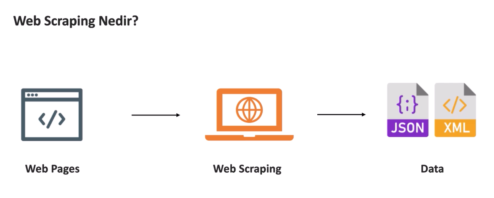
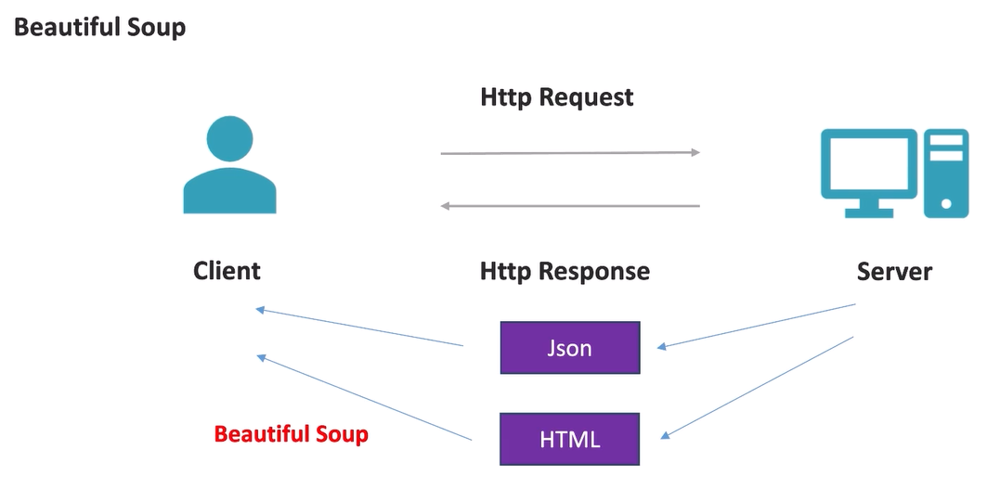

# Web Scraping

Web scraping, web sayfalarından veri toplama işlemi için kullanılan bir tekniktir. Eğer bir web servisi, ihtiyacımız olan bilgileri doğrudan sunmuyorsa, bu yöntemle gerekli veriler elde edilebilir.



## BeautifulSoup Kütüphanesi

[BeautifulSoup](https://www.crummy.com/software/BeautifulSoup/bs4/doc/) kütüphanesi, HTML veya XML içeriğini analiz etmek ve bu içeriklerden veri çıkarmak için kullanılır. Python'da web scraping yaparak sayfalardan alınan veriler, bu kütüphane sayesinde düzenli bir şekilde işlenebilir.

Kurulum:
```bash
pip install beautifulsoup4
```



## Web Scraping Temel Konseptleri

### 1. **Tagler ile Seçim (tags.py)**

HTML dosyasındaki etiketlere (tags) göre veriler alınabilir. Örneğin:
```python
# Belirli bir tag'e ulaşma
tag = obj.find("div")
```

### 2. **find ve find_all Metodları (find.py)**

- `find()`: İlk bulduğu elementi döner.
- `find_all()`: Tüm bulduğu elementleri döner.

Örnekler:
```python
# İlk div elementini bulur
obj.find("div")

# Tüm div elementlerini bulur
obj.find_all("div")
```

### 3. **Attributes ile Seçim (attributes.py)**

HTML elementlerinin `id` ve `class` gibi attribute'larına göre seçim yapılabilir. Örneğin:
```python
# id'si "item1" olan ilk elementi getirir
obj.find(id="item1")

# class'ı "item" olan tüm elementleri getirir
obj.find_all(class_="item")
```

CSS seçiciler (`select` ve `select_one`) ile seçim yapılabilir:
```python
# id'si "header" olan tüm elementleri seçer
obj.select("#header")

# class'ı "item" olan tüm elementleri seçer
obj.select(".item")
```

Özelliklere erişim için `attrs` kullanılabilir:
```python
# id ve class attribute'larına erişim
obj.div.attrs["id"]  # 'item1'
obj.div.attrs["class"]  # ['item', 'red']
```

### 4. **Navigasyon (navigating.py)**

HTML yapısı içinde etiketler arasında gezinebilirsiniz:
- `parent`, `children`, `next_sibling`, `previous_sibling` gibi metotlarla etiketler arasında gezinmek mümkündür.

Örnekler:
```python
# Bir elementin altındaki ilk 3 elemanı alır
obj.body.div.contents[3]

# Bir elementin çocuklarına erişim
obj.body.div.children

# Alt elementlere kadar gitmek
obj.body.div.descendants

# Elementin parent'ını almak
obj.body.h2.parent
```

- `next_element`, `next_sibling` ve `find_next_sibling` gibi metotlar, sırasıyla bir sonraki veya önceki elemente geçiş yapmayı sağlar.

Örnek:
```python
# Sonraki kardeş elemente gitmek
obj.body.div.next_sibling.next_sibling

# Boşlukları yoksayarak kardeş elemente geçiş yapmak
obj.body.div.find_next_sibling("div")
```

### 5. **Veri Çekme Uygulaması (scraping_uygulama.py)**

Bu proje, BTK Akademi'nin dinamik olarak yüklenen kurslarını web scraping yöntemiyle otomatik olarak CSV dosyasına kaydetmek için geliştirilmiştir.

#### 1) Statik Scraping
Statik HTML üzerinden scraping yapmayı denediğimizde, dinamik olarak yüklenen içerikler statik HTML içinde bulunamadığı için veri çekilemez.

#### 2) Dinamik Scraping (Çözüm)
Dinamik içerikler için `Selenium` kütüphanesi kullanılarak tarayıcı üzerinden sayfa yüklenir. Sayfa tamamen yüklendikten sonra, `BeautifulSoup` ile sayfa analiz edilir.

Örnek:
```python
from selenium import webdriver
from bs4 import BeautifulSoup
import time

driver = webdriver.Chrome()
driver.get("https://btkakademi.gov.tr")
time.sleep(5)  # Sayfanın tamamen yüklenmesini bekleriz

soup = BeautifulSoup(driver.page_source, "html.parser")
# Scraping işlemleri burada yapılır
```

### Özet

- **Web scraping**, web sayfalarındaki verileri almak için kullanılır.
- **BeautifulSoup**, bu verileri Python'da işlenebilir hale getiren güçlü bir araçtır.
- HTML etiketlerine ve attribute'lara göre veriye erişim sağlanabilir.
- Dinamik içerikler için **Selenium** ile tarayıcı üzerinden sayfa yüklenebilir ve veriler çekilebilir.

Bu temel bilgilerle web scraping projeleri geliştirilebilir.
